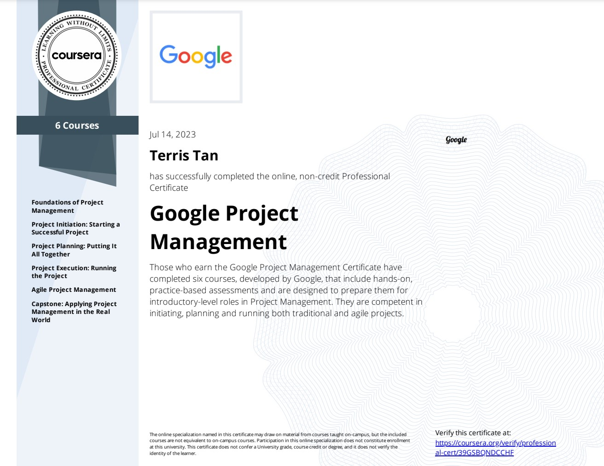

## [Google Project Management: Professional Certificate](https://www.coursera.org/programs/smu-software-engineering-wsdeg-uhmy4/professional-certificates/google-project-management)

 

 

### About this Professional Certificate

Prepare for a new career in the high-growth field of project management, no experience or degree required. Get professional training designed by Google and get on the fastrack to a competitively paid job. **There are over 715,000 open jobs in project management with a median entry-level salary of $77,000.**

**Project managers** are natural problem-solvers. They set the plan and guide teammates, and manage changes, risks, and stakeholders.

Gain in-demand skills that will prepare you for an entry-level job. Learn from Google employees whose foundations in project management served as launchpads for their own careers.

Upon completion, you can directly apply for jobs with Google and over 150 U.S. employers including Deloitte, Target, Verizon, and of course, Google.

This program qualifies you for over 100 hours of project management education, which helps prepare you for [Project Management Institute](https://www.pmi.org/) Certifications like the globally-recognized [Certified Associate in Project Management (CAPM)](https://www.pmi.org/certifications/certified-associate-capm).

---

### Applied Learning Project

This program includes over 140 hours of instruction and hundreds of practice-based assessments which will help you simulate real-world project management scenarios that are critical for success in the workplace.

The content is highly interactive and exclusively developed by Google employees with decades of experience in program and project management.

**Skills you’ll gain will include:** Creating risk management plans; Understanding process improvement techniques; Managing escalations, team dynamics, and stakeholders; Creating budgets and navigating procurement; Utilizing project management software, tools, and templates; Practicing Agile project management, with an emphasis on Scrum.

Through a mix of videos, assessments, and hands-on activities, you’ll get introduced to initiating, planning, and running both traditional and Agile projects. You’ll develop a toolbox to demonstrate your understanding of key project management elements, including managing a schedule, budget, and team.

---

## What you will learn

- Gain an immersive understanding of the practices and skills needed to succeed in an entry-level project management role
- Learn how to create effective project documentation and artifacts throughout the various phases of a project
- Learn the foundations of Agile project management, with a focus on implementing Scrum events, building Scrum artifacts, and understanding Scrum roles
- Practice strategic communication, problem-solving, and stakeholder management through real-world scenarios

---

## Skills you’ll gain:

|   **Management**    |        **Business**        |   **Hard Skills**    |    **Soft Skills**     |
| :-----------------: | :------------------------: | :------------------: | :--------------------: |
| Project Management  |      Entrepreneurship      |       Planning       | Business Communication |
|  Change Management  |     Design and Product     |       Finance        |  Business Psychology   |
|   Risk Management   |  Strategy and Operations   |     Storytelling     |     Collaboration      |
|  Budget Management  | Organizational Development |       Writing        |      Influencing       |
| Conflict Management | Supply Chain and Logistics | Software Engineering |       Leadership       |
|                     |      Human Resources       |                      |                        |
|                     |                            |                      |                        |
